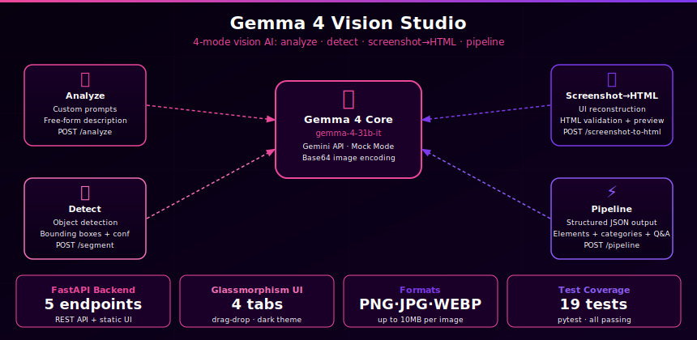

# Gemma 4 Vision Studio

> Built autonomously by [NEO](https://heyneo.com) — your fully autonomous AI coding agent. &nbsp; [](https://marketplace.visualstudio.com/items?itemName=NeoResearchInc.heyneo)



A live web application that combines three powerful vision AI capabilities in one place — image analysis, object detection/segmentation, and screenshot-to-HTML conversion — all powered by Gemma 4 via Google Gemini API.

---

## Why This Exists

Vision AI is powerful but fragmented. You need one tool for image description, another for object detection, and a separate service to turn screenshots into code. This studio combines all three behind a single clean web UI, with a mock mode so you can build and demo without an API key.

---

## What It Does

```
Upload Image  ──►  Choose Mode  ──►  Get Results
                        │
         ┌──────────────┼──────────────┐
         ▼              ▼              ▼
   Analyze Image    Segment It    Screenshot → HTML
   (Gemma 4)        (DETR model)  (Gemma 4 vision)
   
   "What's in       Bounding boxes  Ready-to-use
   this image?"     + labels on     HTML/CSS code
                    the image
```

---

## Three Modes

### Image Analysis
Upload any image and ask a natural language question. Powered by Gemma 4 vision — describe scenes, read text, identify objects, explain charts.

### Image Segmentation
Detects objects in the image using Facebook's DETR model (running locally). Returns labeled bounding boxes drawn directly on the image, plus a structured list of detected objects with confidence scores.

### Screenshot to HTML
Upload a screenshot of any UI — a website, app, dashboard — and get back clean, semantic HTML/CSS that recreates the layout. Useful for prototyping, design handoff, or understanding UI structure.

---

## Who Should Use This

| Use Case | How it helps |
|----------|-------------|
| Designers | Turn mockups into HTML instantly |
| Developers | Convert legacy UI screenshots to working code |
| Researchers | Batch-analyze and label images without writing code |
| Product Teams | Demo vision AI capabilities to stakeholders |
| Students | Experiment with vision models in a friendly UI |

---

## How It Helps

**Before:** Separate API calls, different SDKs, stitching together outputs manually.

**After:** One URL, drag-and-drop upload, instant results in the browser. Works with or without a Gemini API key (mock mode for development).

---

## Architecture

```
Browser (index.html)
    │  drag-drop upload, 3-tab UI
    │
    ▼
FastAPI (app.py) ─── /analyze          ──► GemmaClient (Gemini API / mock)
                 ─── /segment          ──► ImageSegmenter (DETR, local)
                 ─── /screenshot-to-html ──► ScreenshotToHTML → GemmaClient
                 ─── /health
                 ─── / (serves UI)
```

---

## Quick Start

### Install dependencies

```bash
pip install -r requirements.txt
```

### Set your API key (optional — works without one in mock mode)

```bash
cp .env.example .env
# Edit .env and add your GEMINI_API_KEY
```

### Start the server

```bash
uvicorn app:app --host 0.0.0.0 --port 8000 --reload
```

Open `http://localhost:8000` in your browser.

---

## Configuration

| Variable | Default | Description |
|----------|---------|-------------|
| `GEMINI_API_KEY` | *(empty)* | Gemini API key — if not set, runs in mock mode |
| `GEMINI_MODEL` | `gemma-4-31b-it` | Which Gemma model to use |
| `MAX_IMAGE_SIZE_MB` | `10` | Maximum upload size |
| `MOCK_MODE` | auto-detected | True if no API key set |

---

## API Endpoints

| Endpoint | Method | What it does |
|----------|--------|-------------|
| `GET /` | GET | Serves the web UI |
| `POST /analyze` | POST | Analyze image (form: `file`, optional `prompt`) |
| `POST /segment` | POST | Detect/segment objects (form: `file`) |
| `POST /screenshot-to-html` | POST | Generate HTML from screenshot (form: `file`) |
| `GET /health` | GET | Health check + mock mode status |

---

## Project Structure

```
gemma4-vision-studio/
├── app.py               # FastAPI app + all endpoints
├── gemma_client.py      # Gemini API wrapper with mock fallback
├── segmenter.py         # DETR object detection (local, no API needed)
├── screenshot_to_html.py# Screenshot → HTML converter
├── config.py            # Settings and environment variables
├── requirements.txt
├── .env.example         # API key template
├── static/
│   └── index.html       # Dark-themed 3-tab frontend
└── tests/
    └── test_app.py      # 15 pytest tests (all endpoints mocked)
```

---

## Running Tests

```bash
pytest tests/ -v
```

15 tests covering all endpoints and core classes. No API key or GPU required — all external calls are mocked.

---

## License

MIT
